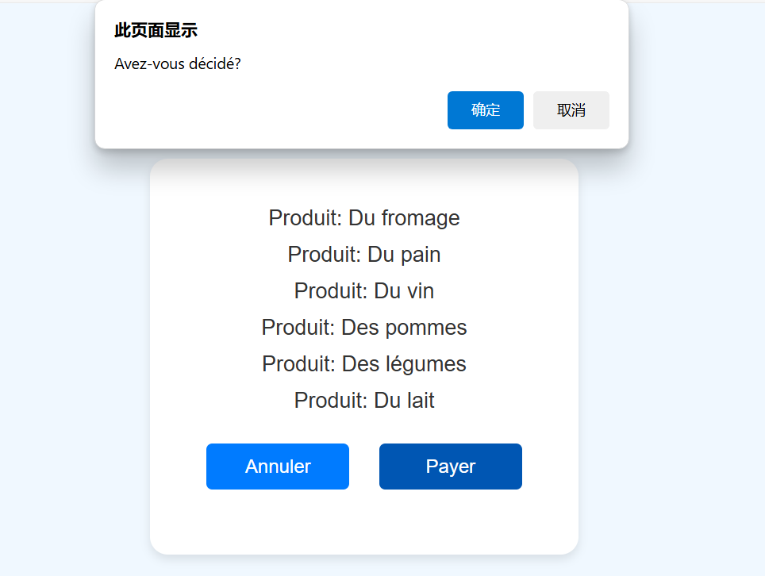
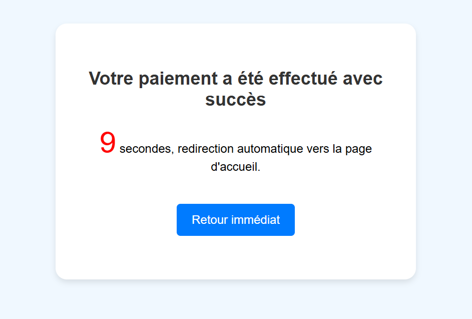

<div style="text-align: center;">
  
  <p>C'est une image pour confirmer une action.</p>
</div>

<div style="text-align: center;">
  
  <p>C'est une image pour indiquer un succès.</p>
</div>


# Projet Simple de Confirmation de Paiement

Il s'agit d'un projet simple en HTML, CSS et JavaScript simulant un processus de confirmation de paiement pour des produits. Le projet est composé de deux pages HTML :

1. **index.html** : Affiche une liste de produits et contient deux boutons : "annuler" (Annuler) et "payer" (Payer).
2. **succ.html** : Affiche une page de confirmation avec un minuteur de 10 secondes qui redirige vers une URL spécifiée (dans ce cas, la page GitHub).

## Structure du Projet

- **index.html** : Affiche une liste de produits et permet à l'utilisateur d'annuler la transaction ou de procéder au paiement. En cliquant sur le bouton "Payer", une fenêtre de confirmation s'affiche pour demander à l'utilisateur de confirmer le paiement.
- **succ.html** : Une fois le paiement confirmé, cette page s'affiche. Elle montre un message indiquant que le paiement a été effectué avec succès et démarre un compte à rebours de 10 secondes avant de rediriger l'utilisateur vers une URL spécifiée.

### Fichiers :

- `index.html` : Page principale avec la liste de produits et les boutons.
- `succ.html` : Page de succès avec un minuteur de redirection.
- `README.md` : Description et instructions du projet.
- `.git/` : Configuration du dépôt Git.

## Comment Exécuter

1. Ouvrez `index.html` dans un navigateur web.
2. Consultez la liste des produits.
3. Cliquez sur "payer" pour lancer le processus de paiement. Une boîte de dialogue de confirmation apparaîtra.
4. Si confirmé, la page redirigera vers `succ.html` où le succès du paiement est affiché.
5. Après 10 secondes, la page redirige automatiquement vers `https://github.com/ArthurXian`.

## Fonctionnalités

- **Boîte de Confirmation** : Une boîte de dialogue apparaît lorsque l'utilisateur clique sur le bouton "Payer" pour confirmer le paiement.
- **Minuteur de Redirection** : Après la confirmation du paiement, la page de succès (`succ.html`) affiche un compte à rebours de 10 secondes avant de rediriger l'utilisateur vers une autre page.
- **Design Réactif** : La page s'adapte à différentes tailles d'écran grâce au CSS.

## Technologies Utilisées

- **HTML5** : Pour structurer le contenu des pages.
- **CSS** : Pour la mise en page et le style de base.
- **JavaScript** : Pour implémenter la boîte de confirmation, la logique de redirection et le minuteur.

# ✨ Notes JavaScript 🌟

## 📌 1. Tableaux et Index
- **`（） [ ]`** : Cela indique que nous voulons récupérer l'élément à l'intérieur de `()` en utilisant l'index (à partir de 0).

---

## 📌 2. Événement de clic : `onclick`
- **`onclick`** : C'est un événement qui se déclenche lorsqu'on clique sur un élément.
  - **📝 Syntaxe** :
    ```javascript
    element.onclick = function() {
        // Code à exécuter lors du clic
    }
    ```
  - Ajoute un **événement de clic** à un élément. Lorsque l'utilisateur clique dessus, le code dans la fonction sera exécuté.

---

## 📌 3. Fonction anonyme : `function () { ... }`
- **`function () { .... }`** : Représente une **fonction anonyme**.
  - Les **parenthèses `()`** peuvent contenir des paramètres. Si elles sont vides, la fonction ne prend pas de paramètres.
  - Les **accolades `{}`** contiennent le code qui sera exécuté lorsque la fonction est appelée.

---

## 📌 4. Déclaration de variable : `let`
- **`let`** : Mot-clé pour déclarer une variable.
  - **Exemple** :
    ```javascript
    let a = 1;  // Déclare la variable a avec la valeur 1
    ```

---

## 📌 5. Signification du point `.` 
- **`.`** : Utilisé pour accéder à une **propriété** ou une **méthode** d'un objet.
  - **objet.propriété** : Permet d'obtenir ou de modifier la valeur d'une propriété.
  - **objet.méthode()** : Permet d'appeler une méthode (fonction) sur l'objet.

---

## 📌 6. Objet `window`
- **`window`** : Représente l'**objet fenêtre** dans lequel la page est affichée, contenant des informations et des méthodes liées au navigateur.

---

## 📌 7. Boîte de confirmation : `confirm()`
- **`confirm()`** : Affiche une boîte de dialogue avec des boutons **"OK"** et **"Annuler"**.
  - **Valeurs retournées** :
    - Si l'utilisateur clique sur **OK**, la fonction retourne `true`.
    - Si l'utilisateur clique sur **Annuler**, la fonction retourne `false`.
  - **Exemple** :
    ```javascript
    let result = confirm('Êtes-vous sûr ?');
    ```

---

## 📌 8. Conditionnel : `if`
- **`if`** : Utilisé pour exécuter du code en fonction d'une condition.
  - **Syntaxe** :
    ```javascript
    if (condition) {
        // Code à exécuter si la condition est vraie
    }
    ```
  - **Exemple** :
    ```javascript
    if (res) {
        console.log('Confirmé');
    }
    ```

---

## 📌 9. Adresse actuelle de la page : `location`
- **`location`** : Représente l'adresse (URL) actuelle de la page. Vous pouvez l'utiliser pour obtenir ou changer l'URL de la page.

---

## 📌 10. Changer l'URL : `location.href`
- **`location.href`** : Permet d'obtenir ou de modifier l'URL de la page actuelle.
  - **Exemple** :
    ```javascript
    location.href = 'https://www.example.com';
    ```

---

## 📌 11. Comment savoir quand utiliser `()` ou `=` ?
### 🧠 Astuce de mémoire simple :
- **objet.méthode()** :
  - Les **parenthèses `()`** indiquent l'appel d'une **méthode**, qui exécute une action.

- **objet.propriété = valeur** :
  - L'**égalité `=`** indique que vous modifiez ou obtenez la valeur d'une **propriété**.

### ✨ Résumé :
- **Méthodes** : Utilisez **`()`** pour exécuter une action, comme `alert()` ou `getElementById()`.
- **Propriétés** : Utilisez **`=`** pour obtenir ou modifier une valeur, comme `location.href` ou `document.title`.

---

> 💡 **Conseil** : Rappelez-vous, les **parenthèses `()`** sont pour les **méthodes**, et **l'égalité `=`** est pour les **propriétés** !


---

# ✨ Notes sur le Timer JavaScript 🌟

## 📌 1. Écouteur d'événement : `onload` ⏳
- **`onload`** : Cet événement se déclenche lorsque l'objet (comme une page ou une image) **a fini de charger**.
  - **Exemple** :
    ```javascript
    window.onload = function() {
        // Le code ici sera exécuté lorsque la fenêtre aura fini de charger
    }
    ```
  - **Utilisation** : Souvent utilisé pour initialiser des actions une fois que la page ou l'image est complètement chargée.

---

## 📌 2. Timer : `setInterval()` ⏰
- **`setInterval()`** : Utilisé pour **configurer un minuteur** qui exécute une fonction **à intervalles réguliers**, en millisecondes.
  - **Syntaxe** :
    ```javascript
    setInterval(fonction, millisecondes);
    ```
    - **1 seconde = 1000 millisecondes**, donc le code dans la fonction sera exécuté chaque fois que le délai spécifié est écoulé.
  - **Exemple** :
    ```javascript
    setInterval(() => {
        console.log("Exécution toutes les secondes !");
    }, 1000);  // Exécution toutes les 1 seconde
    ```

---

## 📌 3. Fonction fléchée : `() => {}` 🎯
- **`() => {}`** : Ceci est une **fonction fléchée**, une façon plus concise d'écrire des fonctions.
  - **`()`** : Ici, on peut placer des paramètres ;
  - **`{}`** : Contient les instructions à exécuter.
  - **Exemple** :
    ```javascript
    setInterval(() => {
        // Instructions à exécuter
    }, 1000);
    ```

---

## 📌 4. Manipulation du DOM : `innerText` ✏️
- **`innerText`** : Utilisé pour **obtenir ou définir** le contenu textuel d'un élément HTML.
  - **Syntaxe** :
    ```javascript
    document.getElementById('elementId').innerText = "Nouveau contenu";
    ```
  - **Utilisation** : Permet de mettre à jour le texte affiché sur la page.
  - **Exemple** :
    ```javascript
    document.getElementById('jumpTo').innerText = timer;
    ```

---

## 📌 5. Opérateur de décrémentation : `timer--` 🔢
- **`timer--`** : C'est un opérateur de décrémentation, qui diminue la valeur de `timer` de **1**.
  - **Exemple** :
    ```javascript
    timer--;  // Équivaut à timer = timer - 1
    ```
  - **Utilisation** : Souvent utilisé dans les logiques de compte à rebours ou de comptage.

---

> 💡 **Conseil** : Souvenez-vous que `setInterval()` permet d'exécuter du code **à intervalles réguliers**, et que l'opérateur de décrémentation permet de réduire la valeur d'une variable progressivement. Combinez les deux pour réaliser un compte à rebours facilement ! ⏲️


---


# ✨ JavaScript 笔记 🌟

## 📌 1. 数组与索引
- **`（） [ ]`**：表示我们要获取 `()` 里面第几个元素，从 **0** 开始计数。

---

## 📌 2. 点击事件：`onclick`
- **`onclick`**：这是一个**点击事件**，用于处理用户点击元素时触发的操作。
  - **📝 语法**：
    ```javascript
    element.onclick = function() {
        // 点击事件发生时执行的代码
    }
    ```
  - 给某个获取的元素**添加点击事件**，点击后会执行 `function` 里面定义的事情。

---

## 📌 3. 匿名函数：`function () { ... }`
- **`function () { .... }`**：这是**匿名函数**的写法。
  - **括号 `()`** 里面可以有变量，如果括号内有内容，则表示带参数的函数；
  - **大括号 `{}`** 中直接写你想要执行的操作。

---

## 📌 4. 变量声明：`let`
- **`let`**：是用于声明变量的关键字。
  - **例子**：
    ```javascript
    let a = 1;  // 声明变量 a 并赋值为 1
    ```

---

## 📌 5. 点操作符 `.` 的意义
- **`.`**：用于访问对象的**属性或方法**。
  - **对象.属性**：用于获取或设置对象的某个属性；
  - **对象.方法()**：用于调用对象的某个方法。

---

## 📌 6. 窗口对象：`window`
- **`window`**：代表整个**浏览器窗口**对象，包含了所有和浏览器窗口相关的信息和方法。

---

## 📌 7. 确认框：`confirm()`
- **`confirm()`**：弹出一个带有 **确认** 和 **取消** 按钮的对话框。
  - **返回值**：
    - 如果用户点击 **确认**，则返回 `true`；
    - 如果用户点击 **取消**，则返回 `false`。
  - **例子**：
    ```javascript
    let result = confirm('Are you sure?');
    ```

---

## 📌 8. 条件判断：`if`
- **`if`**：用于执行条件判断。
  - **语法**：
    ```javascript
    if (条件) {
        // 条件为 true 时执行的代码
    }
    ```
  - **例子**：
    ```javascript
    if (res) {
        console.log('Confirmed');
    }
    ```

---

## 📌 9. 当前页面地址：`location`
- **`location`**：表示**当前页面的地址**，可以用来获取或设置当前页面的 URL。

---

## 📌 10. 改变页面地址：`location.href`
- **`location.href`**：可以获取或改变当前页面的 URL 地址。
  - **改变页面地址**的例子：
    ```javascript
    location.href = 'https://www.example.com';
    ```

---

## 📌 11. 如何知道后面接 `()` 还是 `=` 呢？
### 🧠 简单记忆法：
- **对象.方法()**：
  - **括号 `()`** 表示调用**方法**，也就是执行某些动作或行为；
  
- **对象.属性 = 值**：
  - **等号 `=`** 表示修改或设置对象的**属性**，比如设置颜色、大小等。

### ✨ 总结：
- **方法**：**`()`**，代表**执行动作**，如 `alert()`、`getElementById()`。
- **属性**：**`=`**，代表**获取或设置值**，如 `location.href`、`document.title`。

---

> 💡 **提示**：牢记 `()` 是**方法**，`=` 是**属性**，你就不会搞错了！

 
---

> # ✨ JavaScript 定时器笔记 🌟

## 📌 1. 事件监听：`onload` ⏳
- **`onload`**：表示当对象（例如页面或图像）**加载完成时触发某些操作**。
  - **例子**：
    ```javascript
    window.onload = function() {
        // 当 window 加载完毕后，执行此函数内的代码
    }
    ```
  - **用途**：常用于当页面或图片加载完后，执行一些初始化的逻辑。

---

## 📌 2. 定时器：`setInterval()` ⏰
- **`setInterval()`**：设置一个**定时器**，以**毫秒**为单位，**每隔一定时间重复执行一个函数**。
  - **语法**：
    ```javascript
    setInterval(函数, 毫秒数);
    ```
    - **1s = 1000 毫秒**，也就是说，每隔指定的毫秒数，执行一次函数。
  - **例子**：
    ```javascript
    setInterval(() => {
        console.log("每秒执行一次！");
    }, 1000);  // 每秒执行一次
    ```

---

## 📌 3. 箭头函数：`() => {}` 🎯
- **`() => {}`**：这是**箭头函数**，一种简写的函数定义方式。
  - **`()`**：这里可以放参数；
  - **`{}`**：这里放你要执行的操作。
  - **例子**：
    ```javascript
    setInterval(() => {
        // 执行的操作
    }, 1000);
    ```

---

## 📌 4. DOM 操作：`innerText` ✏️
- **`innerText`**：用于**获取或设置**某个 HTML 元素的**文本内容**。
  - **语法**：
    ```javascript
    document.getElementById('elementId').innerText = "新内容";
    ```
  - **用途**：可以实时更新网页上的文本显示。
  - **例子**：
    ```javascript
    document.getElementById('jumpTo').innerText = timer;
    ```

---

## 📌 5. 递减运算符：`timer--` 🔢
- **`timer--`**：是递减操作符，表示将变量 `timer` 的**值减 1**。
  - **例子**：
    ```javascript
    timer--;  // 等价于 timer = timer - 1
    ```
  - **用途**：常用于倒计时或者计数逻辑。

---

> 💡 **提示**：牢记 `setInterval()` 可以让代码**每隔一段时间执行一次**，而递减运算符可以让变量的值逐步减少。结合这两个功能，你就能轻松实现倒计时功能啦！ ⏲️


